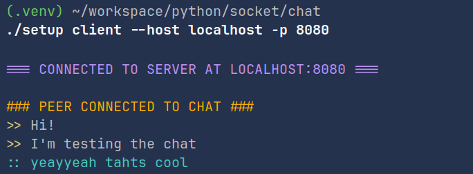

# Stealth Chat
   


## Description

Project that using the **[socket](https://docs.python.org/3/library/socket.html)** library in **Python**, through the *client-server-client* model implements a minimalistic *CLI Chat*. The server is a module that can handle multiple clients at the same time using the multi-threading functionalities. It's able to broadcast messages, execute specific commands for event handling, for communicating with clients. Both clients can chat with each other freely, while the server handles the communication between them. 

## Use Cases

If you find yourself in an insecure network, probably public, or just your job's LAN, can't access social media, or just don't want to distract yourself from your console, and wanna talk to a friend, maybe your couple or a crush, this tool might be helpfull, you can bind the server to your local network, and after both peers got the client, just start to chat and enjoy the process.

## Installation and usage

> **Note:** 
>
> The next steps must be followed for each host that's going to be part of your server, **except** for the step of generating the private key, and the self-signed certificate, that specifically step should only be made in the server host, the clients just need to copy the generated certificate (.crt) to their projects' `cert/server.crt`.

### Setting up environment with UV

#### 1. First of all clone this repository and `cd` into it:

```sh
git clone https://github.com/ndy7stillx86ihz/stealth-chat.git && cd stealth-chat
```

#### 2. Only if you don't have [UV](https://docs.astral.sh/uv/) installed, set it up, *it may just take a few seconds:*

##### For Linux, Mac-OS, WSL:

```sh
curl -LsSf https://astral.sh/uv/install.sh | sh
```

##### For Windows:

```powershell
powershell -ExecutionPolicy ByPass -c "irm https://astral.sh/uv/install.ps1 | iex"
```

> See the documentation on [installer configuration](https://docs.astral.sh/uv/configuration/installer/) for details on customizing your uv installation.

#### 3. Generate a self-signed certificate, and a private key:

##### Execute the `certs/gen-pair.sh` script to automatically generate both or copypaste the following command in your console: 

```sh
mkdir certs && \
openssl genpkey -algorithm RSA -out certs/server.key -aes256 && \
openssl req -new -x509 -key certs/server.key -out certs/server.crt -days 365
```

#### 4. For each client you must copy the certificate `server.crt` that's in the `certs` folder to that same folder in the client host, if you are the one who hosted the server, you already have it locally, so there's no need to do it.

### Server

#### To start the server, run the following command:

```bash
uv run src/app.py server -p <port> -H <hostdir> -m <max-connections>
```


> **Be sure of setting up the server before trying to connect with client,  if not, you'll get an exception**

### Client

#### After someone hosts the server, enter the retrieved info

```bash
uv run src/client -p <server-port> -H <server-host>
```

> At first, you'll need to wait for the other peer to connect, you'll be able to send messages, but no one will receive them, whenever the peer sets up, the server will notify every client that there's at least one user to chat with.

## Known Issues

1. **Clients not being disconnected after closing server:** Sometimes after *KeyboardInterrumpting* the Server, the clients may just close as it's meant to be, but can also bug like receiving infinites messages.

   #### If you find any other Issue, please feel free to report it, or collaborating with the project :)

## License

This project is licensed under the MIT License - see the [LICENSE](LICENSE) file for details

